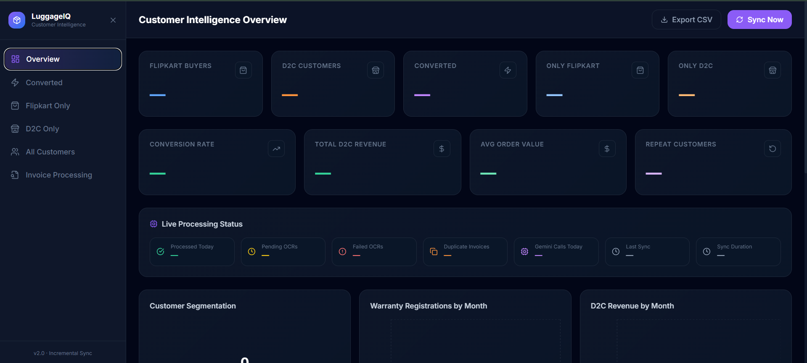

# 🧳 Customer Intelligence Dashboard

## What Is This?

A smart dashboard that automatically tracks your customers across **Flipkart** (your wholesale channel) and your **own website** (Shopify/D2C).

### The Problem It Solves

- You sell luggage on Flipkart AND your own website
- Customers who buy from Flipkart fill out warranty forms
- You have Shopify order data in a spreadsheet somewhere
- **You want to know:** Who came from Flipkart and bought again from you? Which customers are your best repeat buyers? Which products and cities are winning?

### The Answer

This dashboard **automatically** finds and tracks your customers across both channels, shows you conversion rates, revenue trends, and customer journeys — updating every 30 minutes without you lifting a finger.

No more manual spreadsheet hunting. No more guessing. Just real data about your real customers.

---

## � What You Can See in the Dashboard



### **Overview Page**

- **Key Numbers**: How many customers converted, total revenue, repeat customers
- **Charts**: Revenue trends, registration trends, top products, top cities, size & color preferences

### **Converted Customers Page**

- **Customer List**: See everyone who bought from both Flipkart AND your website
- **Customer Journey**: Click on any customer to see their complete purchase history (warranty → Flipkart → your website)

### **Segmentation Pages**

- **Flipkart Only**: Customers who only bought from Flipkart (opportunity to convert)
- **D2C Only**: New customers buying directly from your website
- **All Customers**: Complete customer database with contact info and purchase data

---

## 🔄 How It Works (Simple Version)

```
┌─────────────────────────────────────────────────────────────────┐
│                        EVERY 30 MINUTES                         │
└─────────────────────────────────────────────────────────────────┘

         Google Sheets (Warranty Tab)
                    │
                    ▼
         Read only NEW rows (skip already processed)
                    │
                    ▼
         Each row has a customer's Google Drive link
         (could be a photo, PDF, or a whole folder)
                    │
                    ▼
         Open the Drive file — read it in memory
         (never saved to disk)
                    │
                    ▼
         Send to Gemini AI Vision (OCR)
         → Extract: name, email, phone, product,
           order ID, invoice date, city, amount, platform
                    │
                    ▼
         Save structured data to local database
                    │
                    ▼
         Google Sheets (Shopify Tab)
         → Read all D2C orders
                    │
                    ▼
         Match Flipkart customers ↔ Shopify customers
         (by email or phone number)
                    │
                    ▼
         Segment into:
         🟣 Converted (bought on both)
         🔵 Flipkart Only
         🟠 D2C Only
                    │
                    ▼
         Dashboard updates automatically
```

Every 30 minutes, the system does this automatically:

1. **Read Your Data**
   - Warranty registrations from your Google Sheets
   - Shopify orders from your Google Sheets
   - Invoice files from Google Drive links

2. **Extract Information**
   - Uses AI to read invoice photos/PDFs
   - Gets customer name, email, phone, product, amount, location, etc.
   - Stores everything locally (no cloud storage needed)

3. **Match Customers**
   - Finds customers who appear in BOTH Flipkart AND Shopify data
   - Labels them as "Converted" customers

4. **Build Dashboard**
   - Updates all charts and reports
   - Shows you the insights in real-time

**Scheduler** = Runs in the background, triggers a fresh sync every 30 minutes automatically

---

## 📊 What the Dashboard Shows

### Tab 1 — Overview

The main page with everything at a glance:

| Card              | What it tells you                                                  |
| ----------------- | ------------------------------------------------------------------ |
| Flipkart Buyers   | How many unique customers registered warranty (came from Flipkart) |
| D2C Customers     | How many unique customers ordered from your website                |
| Converted         | Customers who did BOTH — bought on Flipkart AND your website       |
| Conversion Rate   | % of Flipkart buyers who came back to D2C                          |
| Total D2C Revenue | Sum of all Shopify orders                                          |
| Avg Order Value   | Average amount per D2C order                                       |
| Repeat Customers  | D2C customers who ordered more than once                           |
| Pending OCRs      | Invoices waiting to be read                                        |
| Failed OCRs       | Invoices that couldn't be read (you can retry)                     |

**Charts included:**

- Customer segmentation donut (Converted vs FK-only vs D2C-only)
- Warranty registrations by month
- D2C revenue by month
- Top 10 products
- Top 10 cities (split Flipkart vs D2C)
- Size distribution
- Colour distribution
- Payment methods

### Tab 2 — Converted Customers

A table of every customer who bought on Flipkart AND came back to your website.
You can click **"View Journey"** to see their timeline: Flipkart purchase → D2C orders.

### Tab 3 — Flipkart Only

Customers who registered warranty but haven't bought from your D2C site yet.
These are your **retargeting audience**.

### Tab 4 — D2C Only

Customers who found you directly without going through Flipkart first.

### Tab 5 — All Customers

Every single customer in one unified searchable table with colour-coded source badges.

### Tab 6 — Invoice Processing

A live log of every invoice file that was processed — success, failed, or pending.
You can retry failed invoices with one click.

---

## � Key Features

### Automatic Everything

- Syncs automatically every 30 minutes
- Reads invoice photos/PDFs using AI
- Updates dashboard in real-time
- Never processes the same file twice (smart caching)

### Smart Matching

- Finds customers by email or phone number
- Fuzzy name matching as backup
- Shows you exact conversion paths

### Security & Privacy

- All data stored locally on your computer
- Google credentials stored safely
- Invoice files read in memory (never saved to disk)
- No data sent to the cloud except to read the files

### Works with Real Data

- Handles thousands of customers
- Processes hundreds of invoice files
- Handles photos, PDFs, and folders
- Flexible column names (auto-detects them)

---

## 🚀 Quick Start

### Step 1: Get Your Data Ready

Create a Google Sheet with two tabs:

- **Tab 1**: Warranty Registrations (email, phone, product, warranty link to invoice)
- **Tab 2**: Shopify Orders (order data from your D2C store)

Or use local Excel files in the `sheets/` folder.

### Step 2: Start the Dashboard

**Open Terminal 1:**

```
cd e:\Coding\dashborad
.\venv\Scripts\python -m uvicorn main:app --host 0.0.0.0 --port 8000 --app-dir backend
```

**Open Terminal 2:**

```
cd e:\Coding\dashborad\frontend
npm run dev
```

**Then go to:** `http://localhost:5173`

That's it! The dashboard will start reading your data.

---

## 📝 What You'll See

| Page                    | What It Shows                                                                            |
| ----------------------- | ---------------------------------------------------------------------------------------- |
| **Overview**            | Total customers, revenue, conversion rate + 5 charts (trends, top products, cities, etc) |
| **Converted Customers** | Everyone who bought from both Flipkart AND your website                                  |
| **Flipkart Only**       | Customers who only bought from Flipkart (potential to convert)                           |
| **D2C Only**            | New customers buying directly from you                                                   |
| **All Customers**       | Complete database with emails, phones, and sources                                       |
| **Invoice Processing**  | Log of all processed invoices with status                                                |

---

## ⚙️ How to Customize

**Edit `.env` file** to change:

```
GEMINI_API_KEY=your_key_here      # For invoice reading
GOOGLE_SHEET_NAME=Your Sheet Name  # Name of Google Sheet to read
SYNC_INTERVAL_MINUTES=30           # How often to sync (in minutes)
```

**Use local Excel files instead of Google Sheets:**

- Put Excel files in `sheets/` folder
- System reads them automatically (no cloud needed)

---

## 🐛 Troubleshooting

### Dashboard shows no data?

- Check that your Google Sheet has data in Tab 1 and Tab 2
- Wait for the next auto-sync (every 30 minutes) or click "Sync Now"
- Check logs in backend terminal for errors

### Invoice reading stops?

- You hit the Google Gemini free-tier limit (20 reads per day)
- System automatically falls back to using just the Excel data
- Use local Excel files instead of Google Drive links to avoid this

### Charts are empty?

- Make sure warranty and Shopify data has valid dates
- Check that emails/phones in both sheets match

---

## 📁 File Structure

```
dashborad/
├── backend/              ← Brain (Python)
├── frontend/             ← Interface (React)
├── database/             ← Data storage (SQLite)
├── sheets/               ← Your Excel files
├── .env                  ← Your settings & API keys
└── credentials.json      ← Google login (auto-created)
```

---

## 💡 In a Nutshell

**What it does:**

- Reads your warranty registration data
- Reads your Shopify order data
- Uses AI to extract info from invoice photos/PDFs
- Matches customers across both platforms
- Shows you beautiful charts and insights

**Why you need it:**

- Know your conversion rate (Flipkart → D2C)
- Identify your best repeat customers
- Understand which products, cities, and categories are winning
- Make data-driven decisions about inventory, marketing, and pricing

**How it works:**

- Runs automatically every 30 minutes
- No manual data entry needed
- Works with Google Sheets OR local Excel files
- All data stays on your computer (secure & private)

**What you get:**

- Live dashboard with KPIs and charts
- Customer segments (converted, Flipkart-only, D2C-only)
- Customer journey timeline
- Invoice processing status
- All queryable and exportable data

---

## ✨ Current Status

✅ **Working Features:**

- Dashboard with 6 pages
- Real-time KPI calculations
- Customer matching across Flipkart & D2C
- Invoice reading with AI
- Automatic syncing every 30 minutes
- Journey timeline for converted customers
- Revenue & registration charts by month

---

## 🆘 Need Help?

If something isn't working:

1. Check the backend terminal for error messages
2. Make sure your Google Sheet has data
3. Verify your API keys in `.env`
4. Check that dates in your data are valid
5. Review the `.env` file for typos

---

**Made for luggage brands selling on multiple channels. Designed to scale. No coding needed to use it.**
