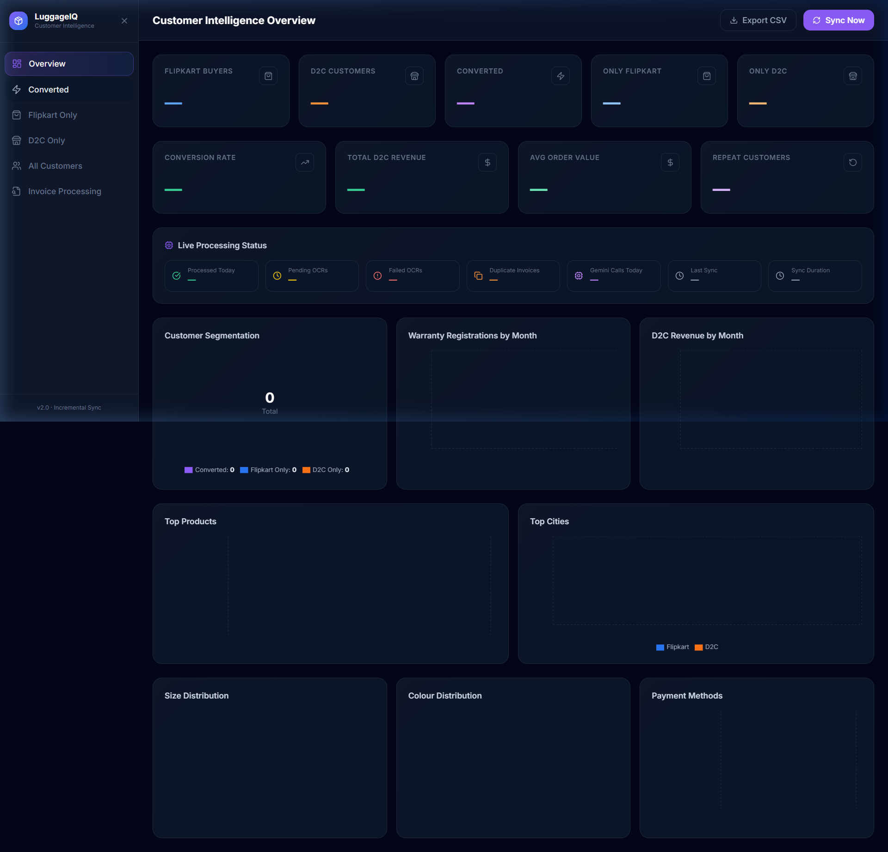
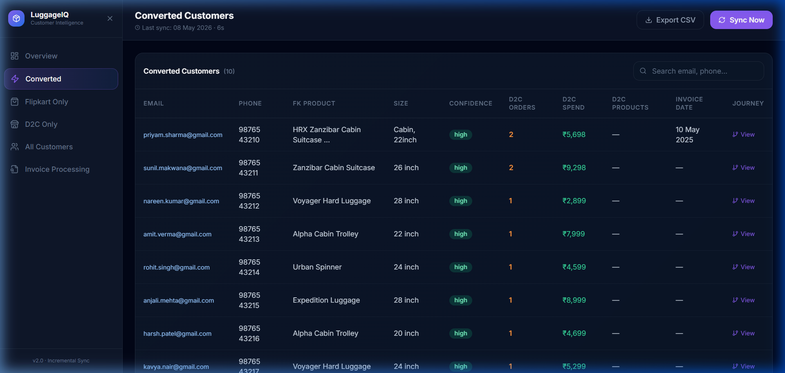

# Customer Intelligence Dashboard — Walkthrough

## What Was Built

A production-grade, full-stack automated analytics system for a luggage ecommerce brand. It ingests live data from Google Sheets and Google Drive, processes invoices via Gemini Vision OCR, and displays unified Flipkart + D2C customer intelligence in a premium dark-mode dashboard.

---

## Live Screenshots


_Overview tab — 9 KPI cards, live processing status, 8 charts_


_Converted Customers tab — searchable table with journey timeline_

---

## How to Start the System

### Terminal 1 — Backend (FastAPI)

```powershell
cd e:\Coding\dashborad
.\venv\Scripts\python -m uvicorn main:app --host 0.0.0.0 --port 8000 --reload --app-dir backend
```

### Terminal 2 — Frontend (React)

```powershell
cd e:\Coding\dashborad\frontend
npm run dev
```

Open: **http://localhost:5173**

> [!NOTE]
> On first backend startup, a browser window will open asking you to sign in with Google to authorise the app. Once done, `token.json` is saved and all future starts are automatic.

---

## Architecture Overview

```
Google Sheets (Warranty + Shopify tabs)
        ↓
  Incremental Row Reader (only new rows)
        ↓
  Drive Link Extractor (file or folder)
        ↓
  In-Memory File Streamer (BytesIO, no disk)
        ↓
  Gemini 2.5 Flash Vision OCR
  [asyncio.Semaphore(3) + exponential backoff]
        ↓
  SQLite: invoice_extractions + processed_files
        ↓
  Matching Engine (email + phone + rapidfuzz)
        ↓
  FastAPI → React Dashboard
```

---

## Key Components

### Backend Files

| File                                    | Purpose                                     |
| --------------------------------------- | ------------------------------------------- |
| `backend/config.py`                     | All env vars + fuzzy column mapping         |
| `backend/database.py`                   | SQLAlchemy models + indexes for 5 tables    |
| `backend/auth.py`                       | Google OAuth with token caching             |
| `backend/services/sheets_service.py`    | Incremental Sheet reader, fuzzy columns     |
| `backend/services/drive_service.py`     | In-memory file streaming, folder listing    |
| `backend/services/ocr_service.py`       | Gemini Vision, rate limiting, PDF→PNG       |
| `backend/services/sync_service.py`      | Full sync orchestrator, idempotent          |
| `backend/services/analytics_service.py` | KPIs, matching engine, all chart data       |
| `backend/api/dashboard.py`              | All `/dashboard/*` endpoints                |
| `backend/api/invoices.py`               | Sync controls, retry, reprocess, CSV export |
| `backend/scheduler.py`                  | APScheduler — immediate + every 30 min      |
| `backend/main.py`                       | FastAPI entry with CORS and lifespan        |

### Frontend Pages

| Tab                | Purpose                                   |
| ------------------ | ----------------------------------------- |
| Overview           | 9 KPI cards + live sync status + 8 charts |
| Converted          | Table with journey timeline modal         |
| Flipkart Only      | Filterable customer table                 |
| D2C Only           | Filterable customer table                 |
| All Customers      | Unified view with source badges           |
| Invoice Processing | File log, status, retry buttons           |

---

## API Endpoints

```
GET  /health
GET  /sync/status
POST /sync/trigger
POST /sync/retry-failed

GET  /dashboard/kpis
GET  /dashboard/conversions
GET  /dashboard/customers?source=all|converted|flipkart|d2c&search=&page=
GET  /dashboard/products
GET  /dashboard/cities
GET  /dashboard/revenue
GET  /dashboard/sizes
GET  /dashboard/colours
GET  /dashboard/payments
GET  /dashboard/journey/{email}
GET  /dashboard/invoices

POST /invoices/{file_id}/retry
POST /invoices/row/{row}/reprocess
GET  /export/csv?type=all|converted|flipkart|d2c
```

---

## Database Tables

| Table                 | Purpose                                   |
| --------------------- | ----------------------------------------- |
| `processed_rows`      | Warranty sheet rows with status lifecycle |
| `processed_files`     | Drive file IDs — permanent OCR cache      |
| `invoice_extractions` | Structured JSON from Gemini OCR           |
| `shopify_orders`      | D2C orders from Sheet Tab 2               |
| `sync_logs`           | Audit log of every scheduler run          |

---

## What Happens on Sync

1. Finds `max(sheet_row_number)` from `processed_rows` → skips everything before it
2. Reads only new warranty rows from Google Sheets (row N+1 onwards)
3. For each row: extracts Drive link → streams file to memory → Gemini OCR → saves JSON
4. Marks `processed_files.file_id` so it's **never re-OCR'd** even if the row appears again
5. Syncs all Shopify orders (upsert by order_id)
6. Runs matching engine → segments customers
7. Writes `sync_logs` entry with counts + duration

---

## Security

- Gemini API key stays in `.env`, never exposed to frontend
- OAuth token stored in `token.json` (not committed to git)
- Invoice files are **never written to disk** — BytesIO only
- CORS restricted to `http://localhost:5173`
